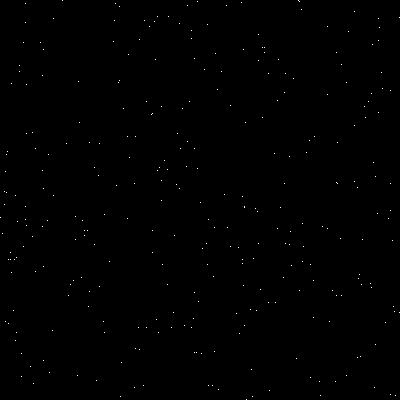

# barnes-hut
## Introduction
The goal of this project is to implement a [Barnes-Hut simulation](https://en.wikipedia.org/wiki/Barnes%E2%80%93Hut_simulation) in Golang. The next few steps are to figure out where concurrency can speed up the algorithm, check the math for errors, and initialize the bodies with velocity to simulate a galaxy. This optimized quadtree implementation will also be used to write a more efficient graph-drawing algorithm.

## Run
Issue the following commands to install dependencies and run the simulation. The output is a file called `sim.gif` that will appear at the root level of the project directory.
```
$ go mod vendor
$ go run main.go
```

## Sample output
